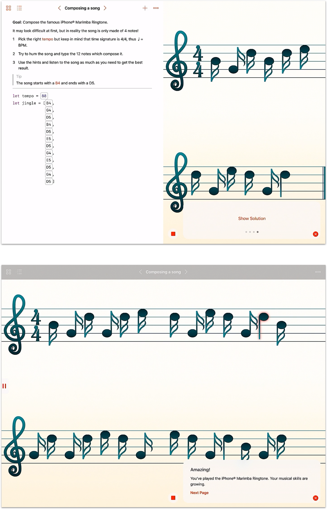
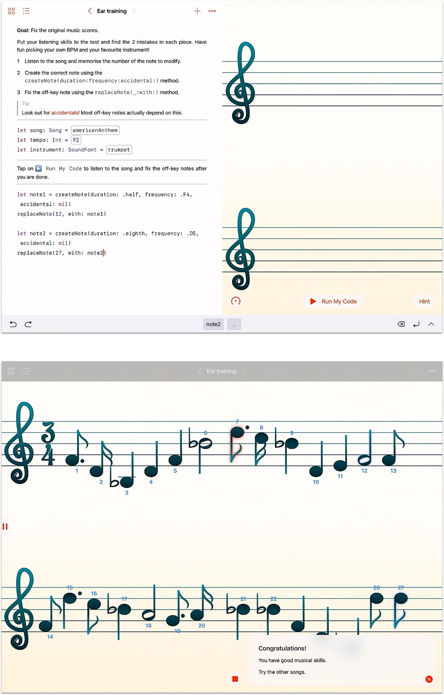

# CodingNotes
**Coding Notes** is a playgroundbook for the WWDC 2017.

Project has been made in `Swift` 3.1 and runs only on iPad®.

## About

In this playgroundBook you can test your musical knowledge using the utmost basic control flow elements like a for-loop, calling a function with set parameters and managing the returning values.
Using a very simple UICollectionViewController it’s possible to get a musical score within which the notes chosen in the exercise/challenge are inserted; thanks to the AVFoundation framework, in particular AVMidiPlayer, it’s also possible to play the musical sequence generated beforehand with your favourite instrument!
You don’t have to be a musician to play through this playground. That’s because you can visually follow the notes shown in the liveView thanks to the automated scrolling and the notes highlighting.

The playgroundBook is made of one chapter and three pages: these three pages actually require a basic knowledge of musical notes, because you must type notes or fix the off-key ones that you hear, but it’s possible to have fun changing instruments, BPM and notes nonetheless!
Each page explains thoroughly what the challenge is about and gives a small hint to complete the task. Whether you can complete the challenge or not, if you’re interested, you can get other tips and the solution to the challenge by browsing through the Hints Section.
Besides the hints available, a dictionary containing less common words’ definitions is also available along with a documentation for the usage of the for-loop.

## 1st Challenge

Composing a song.

## 2nd Challenge

Ear training.

